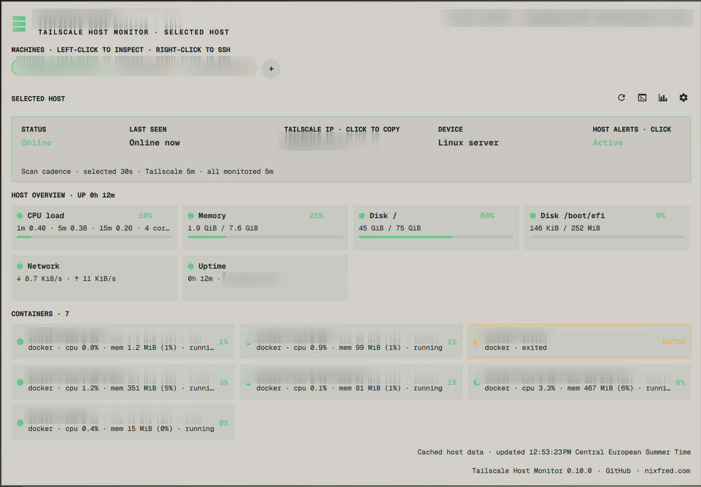
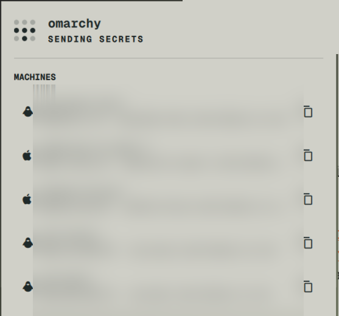
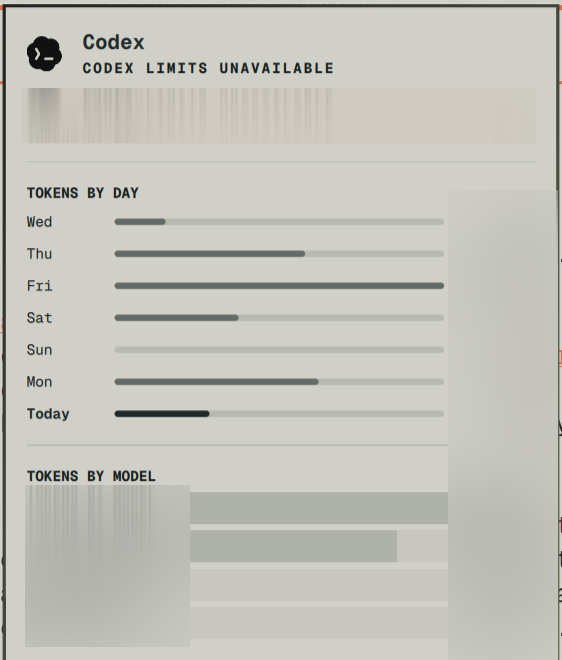
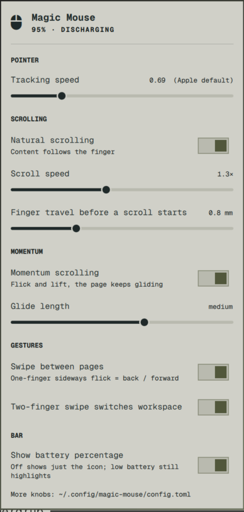
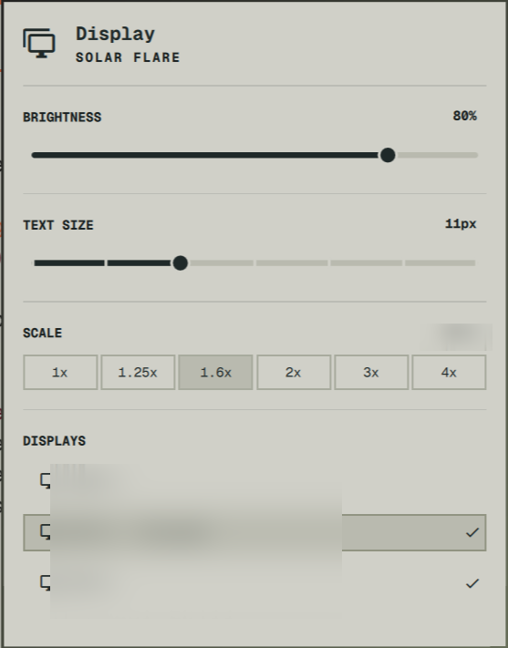

# User-Selected Omarchy UI References

Use these user-supplied screenshots as Daniel's visual baseline when designing plugin UI. Read this profile before work on a new visual surface. The images are privacy-redacted copies: hostnames, addresses, account metrics, and monitor identifiers are intentionally obscured. Treat them as design evidence, never as product content.

## Reference set

### Wide monitoring dashboard

Use for overview panels with several related metrics or repeated entities. Borrow its clear header, aligned metric grid, reserved status colors, and flat grouping. Keep each card's content legible; do not copy the screenshot's truncated labels.

### Compact host picker

Use for short selectable lists. Keep rows quiet and scan-friendly: one strong name, one subordinate detail line, consistent leading icons and trailing actions. The overlapping notification is incidental; it is not part of the plugin design.

### Usage and limits panel

Use for ranked or time-series data. Labels, bars, and values share a clear alignment; a concise unavailable state sits above the data instead of silently replacing it.

### Long settings panel

Use for many related preferences. Organize controls into named sections with consistent vertical rhythm. Put the setting name and current value on one line, explanations immediately below, and controls on a predictable track or right edge.

### Display controls

Use for device/configuration panels. Give sliders, discrete choices, and selected rows distinct but consistent treatments. Preserve selection indication through both shape and icon, not color alone.

## Shared visual language

- **Color roles:** the captures show neutral surfaces, strong foreground text, semantic green for healthy/selected states, and restrained amber for warnings or muted states. Bind these roles to Omarchy's semantic theme tokens; Omarchy adapts them automatically when the active theme changes. Never sample and hardcode screenshot colors or add manual theme-switch mapping.
- **Typography:** consistent monospaced UI typography, a strong title, compact tracked section headings, and smaller subordinate explanations. Align values and repeated columns precisely.
- **Surfaces:** flat panels, fine separators, restrained outlines, and square or near-square geometry. Let layout and typography create hierarchy; keep shadows, gradients, and ornamental decoration out unless the brief specifically calls for them.
- **Composition:** let plugin purpose determine layout. Use a grid for many comparable metrics, a simple list for choices, and a sectioned vertical flow for settings. Reserve cards for repeated entities or metrics rather than turning every control into a card.
- **Controls:** consistent slider tracks and knobs, values aligned opposite their labels, right-aligned toggles, quiet unselected options, and a clear outline/fill/check for selection.
- **Icons and motion:** reuse Omarchy's installed icon providers/fonts; avoid emoji and arbitrary Unicode symbols. Keep motion tied to user action or meaningful state change; skip decorative animation.
- **States:** pair color with text or an icon. Make unavailable, warning, active, and selected states concise and visible without changing the whole visual language.

Carry over hierarchy, rhythm, and restraint—not literal content, dimensions, theme colors, or exact layouts. Build from Omarchy's installed components and tokens, then compare a runtime screenshot against the closest reference. For a substantially different surface, ask which reference should lead instead of forcing one template onto every plugin.
