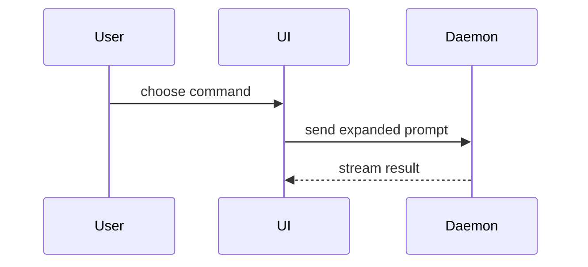

Help the user understand the current topic of conversation visually. Skip the preamble and keep prose brief. Pick the smallest view that makes the key point clear.

- Show logic or an algorithm as pseudocode:

```text
on(save)
  if content is unchanged
    return cached result
  write new content
  return fresh result
```

- Show runtime control flow as a call tree:

```text
submitForm
  createSession
    persistPrompt
    launchAgent
  navigateToSession
```

- Show UI structure as a component tree, including state and module boundaries that matter:

```tsx
<SessionPage> (apps/example/src/routes/session.tsx)
  useSessionEvents()
  <SessionToolbar>
    <RunSkillButton> (packages/ui)
```

- Show file responsibility or a broad refactor as a shallow file tree:

```text
src/
├── commands/       # parses user actions
├── sessions/       # owns session state
└── transport/      # sends API requests
```

- Show component interaction, control flow, or data flow with Mermaid:



- Use `diff` when the point is what changes and the surrounding shape already exists. Match the diff shape to the topic.

For a component change:

```diff
 <SessionPage>
   useSessionEvents()
   <SessionToolbar>
+    <RunSkillButton />
   <SessionTimeline>
+    <SkillResultCard />
```

For a file-layout change:

```diff
 src/
 ├── commands/
+│   └── show-me.ts       # expands the slash command
 ├── sessions/
-└── transport.ts
+└── transport/
+    ├── client.ts
+    └── stream.ts
```

For a call-tree or call-stack change:

```diff
 submitForm
   createSession
     persistPrompt
+    expandSkillMention
     launchAgent
-  navigateToSession
+  navigateToSession
+    subscribeToEvents
```

For a state or control-flow change:

```diff
 on(save)
-  write content
+  if content is unchanged
+    return cached result
+  write content
+  invalidate cache
```

- Show the whole block when most of it is new, when omitted context would hide ownership or order, or when the user needs a copyable target shape:

```ts
function expandSkill(command: string): string {
  const skillName = command.slice(1)
  return `use the ${skillName} skill`
}
```

- For a visual UI, layout, state comparison, or concept too dense for Mermaid, write one focused HTML file — a diagram, an infographic, or a short slide deck, whichever fits the point. Match the product's colors, type, spacing, and components; use real labels and data; support desktop and mobile. Create it inside the current project and open it in Pith's in-app browser, not only in the file preview:

```text
write({ path: ".pith/reports/show-me-{description}.html", content: "..." })
terminal_run({ command: "python3 -m http.server 8765 --directory .pith/reports" })
browser_open({ url: "http://127.0.0.1:8765/show-me-{description}.html", stealth: false })
```

Keep the local HTTP server running while the user reviews the artifact. If port `8765` is occupied, choose another free port and use it in the URL. Stop the server afterwards with `terminal_kill`. Use `preview_file` only for Markdown, source code, or plain-text files where file preview is the intended surface. Do not use shell commands such as `Bash(open ...)` or assume that a local `file://` URL will work.

### guidance

Place each visual next to the short text it supports. Keep only the calls, files, props, states, and boundaries needed to answer the user's current question or the options to resolve the current discussion point. Do not overwhelm the user.

You may use one of these, you may use several, it is unlikely you will use all of them. Use your judgement.
